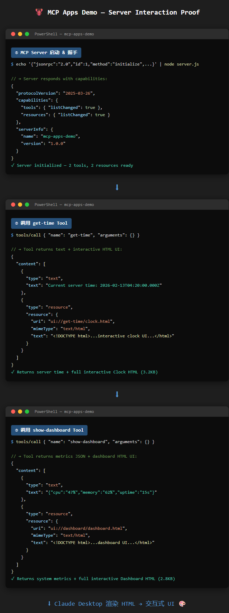
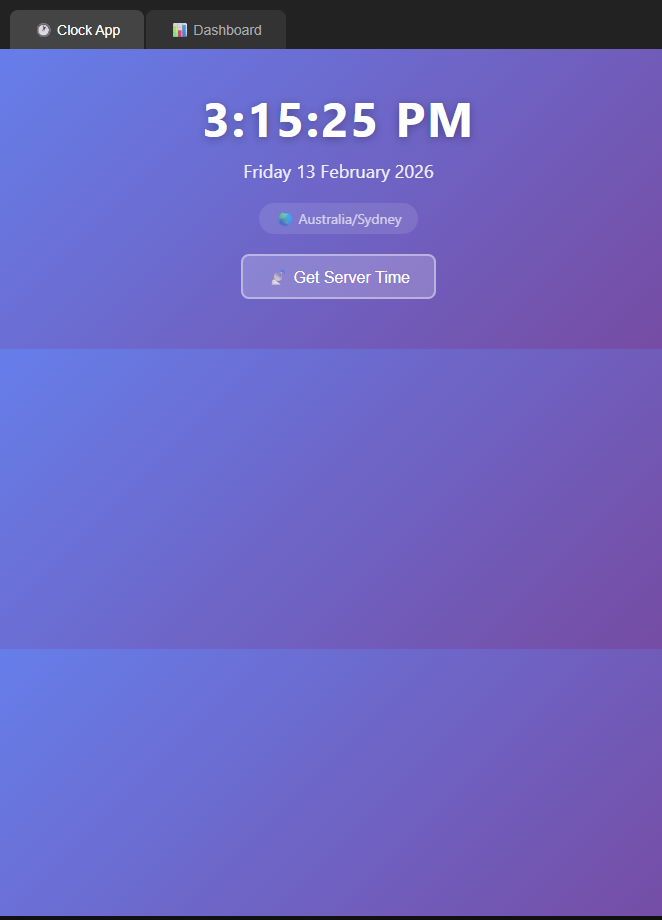
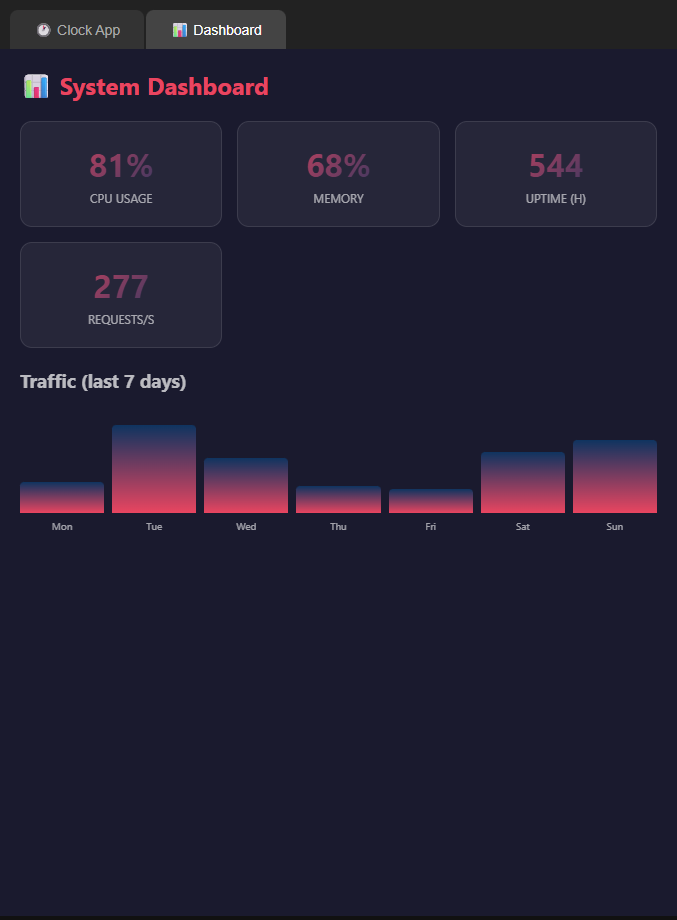

# MCP Apps Demo

Interactive HTML UIs rendered inside AI chat via [MCP Apps](https://modelcontextprotocol.io/docs/extensions/apps) — a new MCP extension that lets tools return rich, interactive UI instead of plain text.

## Screenshots

### 🔧 MCP Server Interaction (Before → Rendering)
The server handles JSON-RPC calls and returns both structured data AND interactive HTML:



### ⏰ Clock App (Rendered UI)
Real-time interactive clock with timezone display and server time fetching.



### 📊 System Dashboard (Rendered UI)
Live system metrics dashboard with CPU, memory, uptime stats and weekly traffic charts.



## What is MCP Apps?

MCP Apps extends the [Model Context Protocol](https://modelcontextprotocol.io/) to allow tools to return **interactive HTML content** that renders directly in the chat UI. Instead of getting a text response like `"The time is 3:15 PM"`, the AI can show you a beautiful, interactive clock widget.

This demo includes two tools:
- **`get-time`** — Returns an interactive clock UI with live updating time
- **`show-dashboard`** — Returns a system metrics dashboard with animated charts

## Quick Start

### 1. Install dependencies
```bash
cd mcp-apps-demo
npm install
```

### 2. Add to Claude Desktop

Edit your `claude_desktop_config.json`:
```json
{
  "mcpServers": {
    "mcp-apps-demo": {
      "command": "node",
      "args": ["/path/to/mcp-apps-demo/server.js"]
    }
  }
}
```

### 3. Add to Claude Code
```bash
claude mcp add mcp-apps-demo node /path/to/mcp-apps-demo/server.js
```

### 4. Try it out

Ask Claude: *"What time is it?"* or *"Show me the system dashboard"*

## How It Works

The server uses `@modelcontextprotocol/sdk` with the `@modelcontextprotocol/ext-apps` extension. Each tool returns an `app` content block containing inline HTML/CSS/JS that the client renders in an iframe.

```js
server.tool("get-time", "Get current time with interactive clock UI", {}, async () => {
  return {
    content: [{
      type: "app",
      html: `<html><!-- interactive clock UI --></html>`
    }]
  };
});
```

## Preview

Open `preview.html` in a browser to see both UIs without needing Claude Desktop.

## Tech Stack

- [MCP SDK](https://www.npmjs.com/package/@modelcontextprotocol/sdk) — Model Context Protocol server
- [MCP Apps Extension](https://www.npmjs.com/package/@modelcontextprotocol/ext-apps) — HTML UI extension
- Vanilla HTML/CSS/JS — No frameworks needed

## License

MIT
